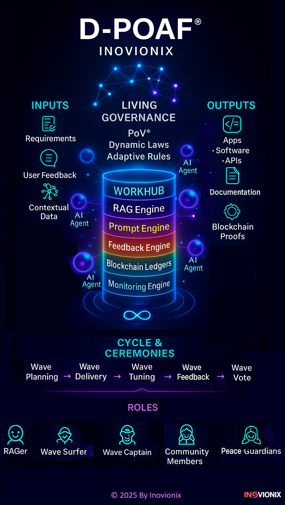

# D-POAF® Framework v2.1
## Decentralized Prompt Oriented Automated Framework

**AI-Native, Secure by Design, Collaborative Software Engineering**

[](https://doi.org/10.5281/zenodo.17113024)
[](LICENSE)

📖 **[Access the Complete Methodological Guide](GUIDE.md)**  
📂 **[Zenodo Archived Version](https://doi.org/10.5281/zenodo.17350252)**

---

## 🌟 Overview

**D-POAF®** is a **next-generation software engineering framework** designed to revolutionize how organizations **design, deliver, and govern** digital projects.

By leveraging **Generative AI**, **Dynamic Blockchain (WaveRegister®)**, and **Living Governance®**, it ensures **traceability**, **security**, and **verifiable value** throughout the entire lifecycle.

**Mission:** To accelerate project delivery while eliminating organizational silos, human error, and centralized decision-making.

---

## 🚀 Why Choose D-POAF®

- **🤖 AI-Native:** Automatically generate deliverables code, tests, documentation, and interfaces guided by intelligent prompts.  
- **⛓️ Dynamic Blockchain (WaveRegister®):** Immutable cryptographic proofs for trust and compliance.  
- **🏛️ Living Governance®:** Decentralized, adaptive governance with evolving rules recorded on-chain.  
- **🤝 Horizontal Collaboration:** Empowered teams, free from rigid hierarchy.  
- **🔒 Secure-by-Design:** Security integrated from the very first step.
- **🌍 Eco-Responsible:** Reducing technical debt, waste, and delays through intelligent automation.

---

## 👥 Founders of D-POAF®

**D-POAF®** was created by two passionate innovators with strong expertise in **AI**, **blockchain**, **cybersecurity**, and **software engineering**.

### 🔹 Azzeddine IHSINE
**Research Engineer in Computer Science, Cybersecurity Specialist**

With nearly 10 years of experience, Azzeddine has contributed to complex systems ranging from startups to multinational corporations. He is the inventor of the D-POAF® core concepts, focusing on **secure-by-design architectures** and **decentralized governance models**.

🔗 [LinkedIn](https://www.linkedin.com/in/azzeddine-ihsine-85b36986) | 📧 contact@inovionix.com

### 🔹 Sara IHSINE
**Research Engineer in Software Engineering, Governance & Strategy Specialist**

Sara played a pivotal role in defining D-POAF®'s **horizontal structure** and **Living Governance® model**, bridging technical innovation with organizational strategy. Expert in audit, strategic transformation, and complex systems governance.

🔗 [LinkedIn](https://www.linkedin.com/in/sara-ihsine-34799748) | 📧 contact@inovionix.com

**Together**, they created D-POAF® to **redefine software engineering** through **AI-native automation**, **blockchain-based traceability**, and **living decentralized governance**.

---

## 🚦 Getting Started

### For Newcomers
1. **Read** the [Complete Methodological Guide](GUIDE.md) to understand core concepts
2. **Try** the Quick Start Guide to launch your first Wave®
3. **Join** our community for support and discussions

### For Product Owners / Managers
Focus on:
- Business Value & Prioritization methods
- Governance models and decision-making
- Real-world use cases and implementations

### For Scrum Masters / Agile Coaches
Focus on:
- Delivery Cycles and Waves®
- Role definitions and responsibilities
- Migration strategies from traditional frameworks

---

## 🎯 Strategic Use Cases

D-POAF® is particularly suited for **regulated, mission-critical industries**:

- **💰 Finance & FinTech** – Secure transactions and compliance-proofed delivery.  
- **🏥 Healthcare & MedTech** – Integrity, traceability, and privacy by design.  
- **🔐 Cybersecurity** – Built-in resilience and proactive threat monitoring.  
- **🏛️ Public Sector & Governance** – Transparent decision-making with immutable records.  
- **🤖 AI Integration at Scale** – Leveraging generative AI for enterprise-wide transformation.

---

## 📖 Citation and DOI

If you use **D-POAF®** in academic work, research, or publications, please cite:

### APA Style
> Inovionix, Ihsine, A., & Ihsine, S. (2025). *D-POAF® Framework (Decentralized Prompt Oriented Automated Framework)* [Framework]. Zenodo.  
> https://doi.org/10.5281/zenodo.17350252

### BibTeX
```bibtex
@software{dpoaf2025,
  author    = {Ihsine, Azzeddine and Ihsine, Sara},
  title     = {D-POAF Framework (Decentralized Prompt Oriented Automated Framework)},
  year      = {2025},
  publisher = {Zenodo},
  version   = {2.1},
  doi       = {10.5281/zenodo.17350252},
  url       = {https://doi.org/10.5281/zenodo.17350252}
}
```

---

## ⚖️ License

D-POAF® Framework is open source under **Apache License 2.0**.

📄 **[View full license terms](LICENSE.md)**

---

## 📦 Repository Structure

```
dpoaf/
├── README.md                    # This overview
├── GUIDE.md                     # Complete methodological guide
├── LICENSE.md                   # Apache License 2.0
├── CONTRIBUTING.md              # How to contribute 
│
├── docs/
│   ├── guide/                   # Detailed methodology (7 parts .md)
│   ├── manifesto/               # Manifesto behind D-POAF (PDF)
│   ├── reference-guide/         # Reference D-POAF guide (PDF)
│   └── glossary.md              # Complete glossary
│
├── templates/                   # Artifacts (Core), Phases and Tracking templates
│   ├── artifacts/               # Core Work Templates
│   ├── phases/                  # Wave Management Phases
│   ├── tracking/                # Learning & Tracking
│   └── README.md                # Templates & Pilot Overview
├── examples/                    # Use cases and practical examples (IN PROGRESS)
└── assets/                      # Images, diagrams, logos
```

---

## 🤝 Contributing

D-POAF® is a living framework that evolves with community feedback.

- 📝 [Contributing Guidelines](CONTRIBUTING.md)
- 🔒 [Security Policy](SECURITY.md) (In progress)
- 🤝 [Code of Conduct](CODE_OF_CONDUCT.md) (In progress)

---

## 🌐 Community & Support

| Platform | Link |
|----------|------|
| 🌐 **Website** | [www.inovionix.com](https://www.inovionix.com/d-poaf-framework) |
| 💬 **Discord** | [Join our community](https://discord.gg/hm5TQn3neJ) |
| 💼 **LinkedIn** | [Follow Inovionix](https://www.linkedin.com/company/inovionix) |
| 📦 **X** | [Follow Inovionix](https://x.com/inovionix) |
| 📧 **Email** | contact@inovionix.com |
| 📂 **Zenodo** | [Official Archive](https://doi.org/10.5281/zenodo.17113024) |

---

## 🏆 Attribution

When referencing or sharing D-POAF®, please include:

> "D-POAF® Framework by INOVIONIX – Open Source (Apache 2.0)"

---

## 🔗 Quick Links

- 📖 [Complete Methodological Guide](GUIDE.md)
- 🚀 [Quick Start Guide](GUIDE.md#quick-start-guide)
- 💡 [Use Cases & Examples](examples/) (In progress)
- ❓ [FAQ](docs/faq.md) (In progress)
- 📚 [Complete Glossary](docs/glossary.md) (In progress)

---

## 📄 Copyright

**© 2025 INOVIONIX. All rights reserved.**

**Authors:** Azzeddine IHSINE & Sara IHSINE  
**Company:** Inovionix  
**Version:** 2.1  
**Date:** October 11, 2025
**Contact:** contact@inovionix.com  
**Website:** www.inovionix.com

---

**Ready to revolutionize your software development? Start with the [Complete Guide](GUIDE.md)** 🚀